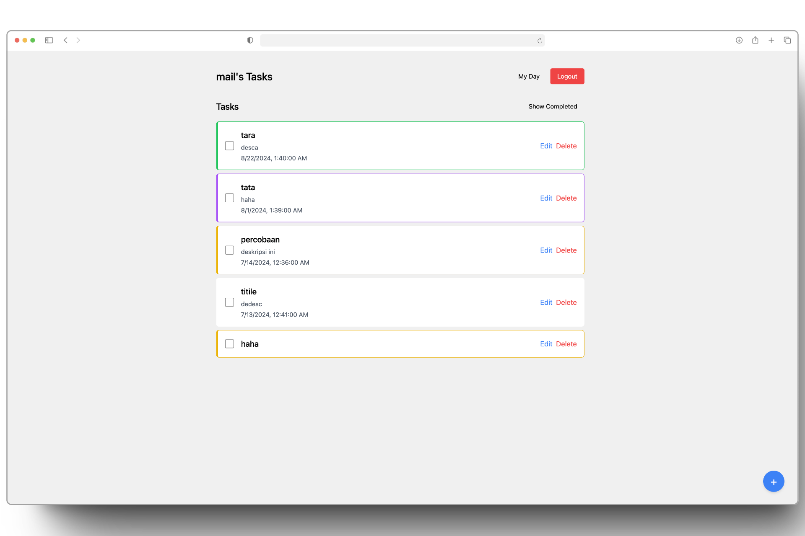
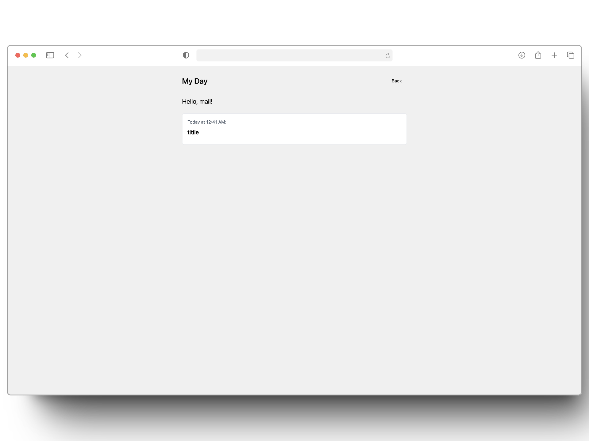
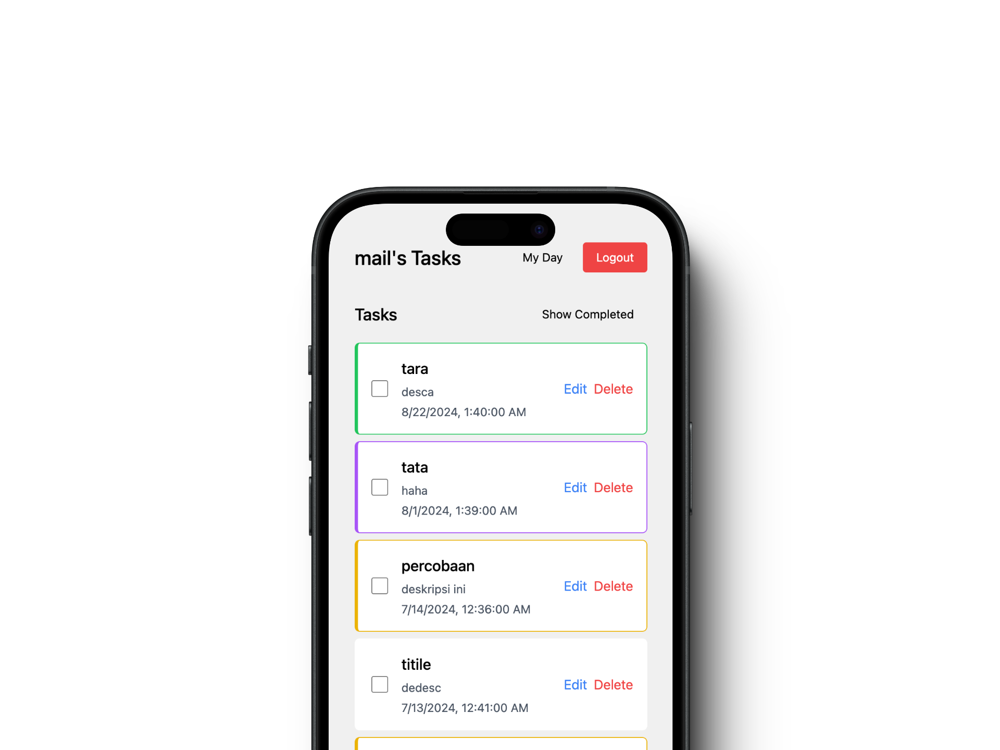

# Geulist

a todo list that just works

## Features

- **Task Management**: Easily create, edit, and delete tasks
- **Task Completion**: Toggle tasks as complete or incomplete
- **Reminders**: Set reminders for your tasks
- **Color Coding**: Organize your tasks visually with color codes
- **My Day View**: Focus on your daily tasks
- **Responsive Design**: Works seamlessly on desktop and mobile devices

## Technologies Used

- Frontend: Vue.js 3
- State Management: Pinia
- Styling: Tailwind CSS
- Backend: Node with ExpressJS

## App preview

| Description     |                Screenshot                 |
| :-------------- | :---------------------------------------: |
| Main feature    |  |
| Added feature   |         |
| Mobile friendly |        |

## Getting Started

### Prerequisites

- Node.js (version 12.0 or higher)
- npm (usually comes with Node.js)

### Installation

To run this apps on local follow these steps:

1. git clone 'this repo url'
   ```
   git clone https://github.com/askpradana/todo-wisata-fe
   cd todo-wisata-fe
   ```
2. create environment from .env.example
   ```
   > cp .env.example .env
   ```
3. fill the .env with your own configuration (or ask me)
4. install depedencies
   ```
   npm install
   ```
5. run the apps (make sure to run backend app first)
   ```
   npm run dev
   ```
6. open browser and navigate to [localhost:5173](http://localhost:5173)

### Contributing

Contributions are welcome! Please feel free to submit a Pull Request.

### License

This project is licensed under the MIT License - see the [LICENSE.md](license.txt) file for details.

### further read

[read](todo.md)
